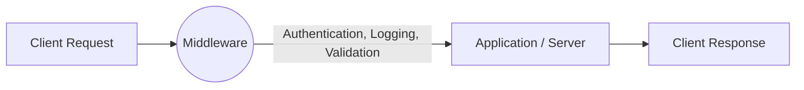

# Middleware

## Key Points
1. Middleware is software that connects different applications or layers, handling communication and data flow.  
2. It provides common services like authentication, logging, security, and request/response processing.  
3. In web development (e.g., Express.js), middleware sits between the client request and server response.

---

## Visualization



### In Express :

Middleware in Express are functions that come into play after the server receives the request and before the response is sent to the client.


#### Common Middleware functions :
- methodOverride
- bodyParser
- express.static
- express.urlencoded


```js
app.use(express.urlencoded({extended : true}));
app.use(express.static(path.join(__dirname,"/public")));
```

  