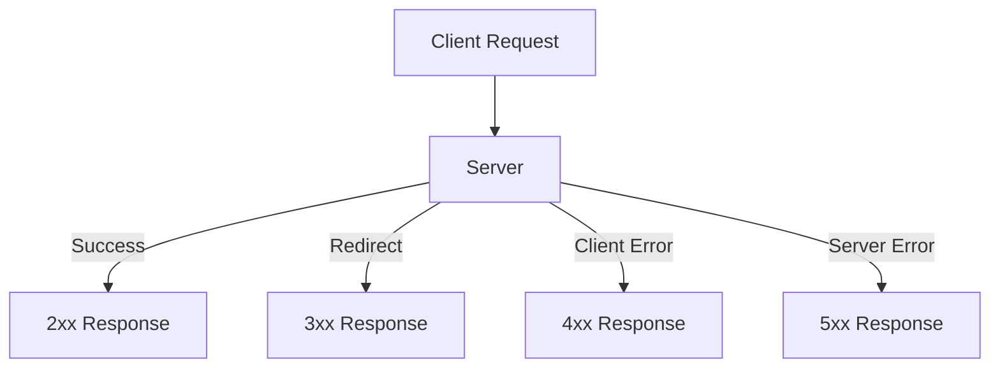

## HTTP response status codes :
# 🌐 HTTP Response Status Codes

HTTP response status codes indicate whether a specific HTTP request has been successfully completed.  

---

## 🔹 1xx – Informational
- **100 Continue** → Request received, continue sending body.  
- **101 Switching Protocols** → Server switching to another protocol (e.g., WebSocket).  

---

## 🔹 2xx – Success
- **200 OK** → Request succeeded.  
- **201 Created** → Resource created successfully (POST/PUT).  
- **202 Accepted** → Request accepted but still processing.  
- **204 No Content** → Success but no response body.  

---

## 🔹 3xx – Redirection
- **301 Moved Permanently** → Resource moved to a new URL.  
- **302 Found** → Temporarily moved to another URL.  
- **304 Not Modified** → Cached version is still valid (no new data).  

---

## 🔹 4xx – Client Errors
- **400 Bad Request** → Invalid request syntax/data.  
- **401 Unauthorized** → Authentication required or failed.  
- **403 Forbidden** → Authenticated but no permission.  
- **404 Not Found** → Resource not found.  
- **405 Method Not Allowed** → Wrong HTTP method used.  
- **429 Too Many Requests** → Rate limit exceeded.  

---

## 🔹 5xx – Server Errors
- **500 Internal Server Error** → Generic server crash/error.  
- **501 Not Implemented** → Server doesn’t support the request method.  
- **502 Bad Gateway** → Server acting as proxy got invalid response.  
- **503 Service Unavailable** → Server overloaded or down for maintenance.  
- **504 Gateway Timeout** → Upstream server didn’t respond in time.  

---

## 📌 Request–Response Flow



## Error Class :
```js 
// ExpressError.js file
class ExpressError extends Error {
    constructor(status, message) {
        super();
        this.status = status;
        this.message = message;
    }
}

module.exports = ExpressError;
```

```js
//inex.js file
const express = require("express");
const app = express();

const ExpressError = require("./ExpressError");

const checkToken = (req, res, next) => {
    let {token} = req.query;
    if(token === "giveaccess")
        next();

    throw new ExpressError(402,"ACESS DENIED!");
}

app.get("/api", checkToken, (req,res)=>{
    res.send("data");
});

app.get("/", (req,res)=>{
    res.send("Hi, I am root");
});

app.listen(8080,()=>{
    console.log("server is listining on 8080 port");
})

```

### Default Error and Message :
`If we write it after (previous code) then it set previos status and message as default`
```js
app.use ((err, req, res, next) =>{
    let {status = 500, message = "Some error occurrs"} = err;
    res.status(status).send(message);
});
```

